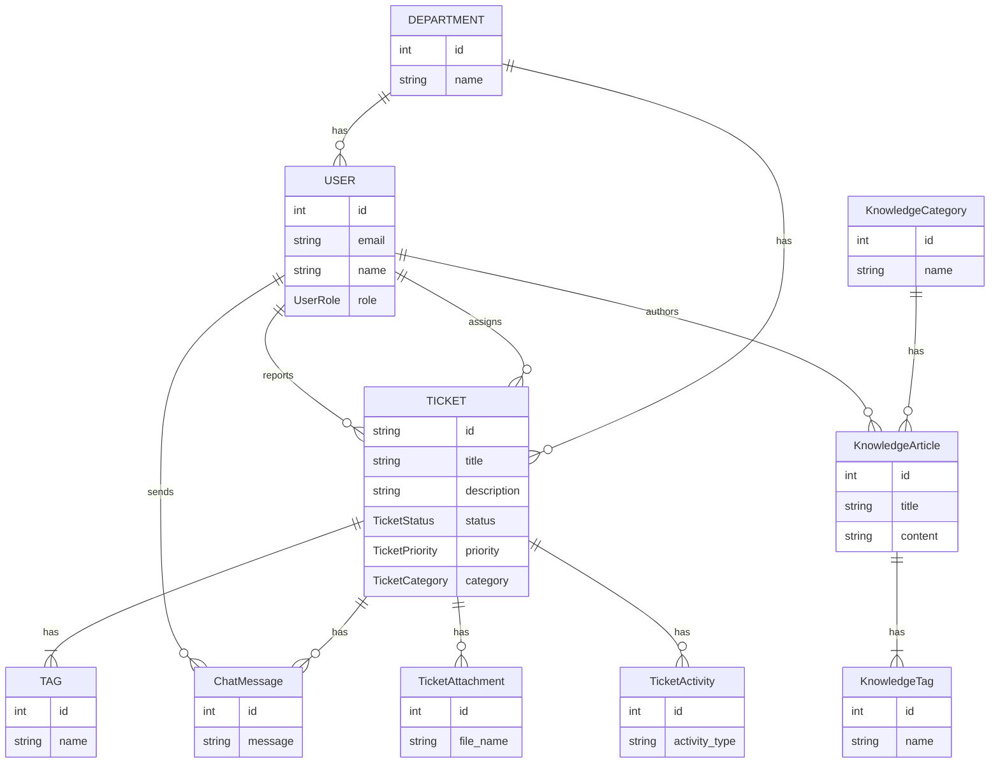
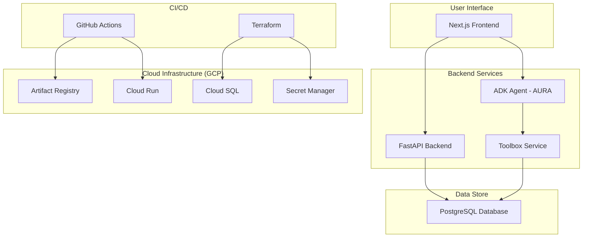

# Intellica ITSM Platform

## Introduction

Intellica is a SaaS production-ready ITSM (IT Service Management) platform, completely driven by an Agentic AI assistant named **AURA** (Autonomous Unified Resilience Agent). It is designed to assist L1 and L2 engineers by providing a knowledge base, creating and managing tickets, and offering other autonomous support features to improve the efficiency of IT operations.

## Features

- **AI-powered Assistant (AURA):** An agent that can understand natural language and assist with various tasks like searching the knowledge base, creating tickets, and providing user support.
- **Ticket Management:** A comprehensive ticketing system that allows users to create, view, update, and manage support tickets.
- **Knowledge Base:** A centralized repository of articles and documents to help users and engineers find solutions to common problems.
- **User and Department Management:** A complete user management system with different roles (Admin, Ops Manager, L1/L2 Engineer, etc.) and department hierarchy.
- **Analytics Dashboard:** A dashboard to view analytics and performance metrics related to tickets, user performance, and more.
- **CI/CD Pipeline:** Automated build and deployment using GitHub Actions and Terraform.

## Architecture

The application is built using a microservices architecture and is deployed on Google Cloud Platform.

- **Frontend:** A Next.js application that provides the user interface.
- **Backend:** A FastAPI application that serves as the main API and handles the business logic.
- **AI Agent (AURA):** A Google Agent Development Kit (ADK) based agent that provides the AI-powered assistance.
- **Toolbox:** A service that exposes a set of tools for the ADK agent to use.
- **Database:** A PostgreSQL database hosted on Google Cloud SQL.
- **Infrastructure:** The infrastructure is managed as code using Terraform.
- **Deployment:** The services are deployed as containers on Google Cloud Run.

## How the Agent (AURA) Works

AURA is built on the Google Agent Development Kit (ADK) and leverages a powerful Gemini model. Its architecture is designed for complex, multi-turn conversations and tool use.

1.  **Session Management:** Every conversation with AURA is stored in a Session Store. This allows the agent to maintain context throughout the conversation.
2.  **Memory Bank:** AURA has a Memory Bank that stores information as embeddings. This allows the agent to recall relevant information from past conversations.
3.  **Tool Use:** AURA can use a set of tools to perform actions. These tools are exposed by the `toolbox` service and allow the agent to interact with the database and other services. For example, AURA can use a tool to search for a document in the knowledge base or to create a new ticket.
4.  **Chain-of-Thought:** AURA uses a chain-of-thought process to break down complex requests into smaller, manageable sub-tasks. It can then use its tools to execute these sub-tasks and provide a comprehensive response.

## AURA Agent Capabilities

### ERD Diagram



### Agent Capabilities

The AURA agent has the following capabilities:

- **Read-only SQL Operations:** AURA can perform read-only operations on the database using the `toolbox` service. This includes:
    - Searching for tickets based on status, priority, assignee, or reporter.
    - Getting the details of a specific ticket.
    - Searching the knowledge base for articles.
    - Getting user details.

- **Write Operations:** AURA can create new tickets by interacting with the FastAPI backend via its OpenAPI schema. This is achieved using the `APIHubToolset` from the Google ADK.

### Demo

[Placeholder for demo.mp4 video]

## Future Vision: A Multi-Agent ITSM Platform

While the current implementation features a single, powerful agent (AURA), this project is designed to evolve into a complete SaaS product where every level of IT support is driven by a specialized AI agent. The goal is to create a multi-agent system where each agent has a specific role and set of capabilities, working together to provide a seamless and efficient ITSM experience.

### High-Level Architecture



### The Vision for a Multi-Agent System

When fully built, the Intellica platform will feature a suite of specialized agents, each tailored to a specific user role and set of tasks:

-   **End-User Agent (AURA):** The first point of contact for all users. It helps with ticket creation, provides status updates, and offers self-service solutions by searching the knowledge base.

-   **L1 Engineer Agent:** A dedicated assistant for Level 1 support engineers. It can handle initial ticket triage, suggest solutions from the knowledge base, gather all necessary information from users, and escalate tickets to L2 when a problem is beyond its scope.

-   **L2 Engineer Agent:** An advanced agent for Level 2 engineers. It can analyze technical data and logs, guide engineers through complex troubleshooting steps, perform root cause analysis (RCA), and even suggest new knowledge base articles based on resolved tickets.

-   **Ops Manager Agent:** A high-level agent for Operations Managers. It can provide a real-time overview of team performance, generate reports on ticket volume, resolution times, and SLA compliance, and identify trends and potential problem areas in the IT infrastructure.

## Services

### `nextjs-frontend`

The main web interface for the Intellica ITSM platform.

- **Framework:** Next.js (React)
- **Language:** TypeScript
- **Key Features:**
    - User login and authentication
    - Ticket creation and management views
    - Knowledge base browsing and search
    - Analytics and reporting dashboards
    - Team performance monitoring
    - A chat interface to interact with AURA

### `fastapi-backend`

The core of the application, providing a RESTful API for the frontend and the agent.

- **Framework:** FastAPI
- **Language:** Python
- **Key Features:**
    - User authentication and authorization
    - CRUD operations for tickets, users, departments, and knowledge base articles
    - An API for the chat interface
    - Analytics data processing
    - [Placeholder for more backend features]

### `adk-agent`

This is AURA, the AI agent.

- **Framework:** Google Agent Development Kit (ADK)
- **Language:** Python
- **Key Features:**
    - Natural Language Understanding
    - Tool integration with the `toolbox` service
    - Manages conversation history and memory
    - [Placeholder for more agent features]

### `toolbox`

This service exposes a set of tools that the `adk-agent` can use.

- **Framework:** Custom (based on `genai-toolbox`)
- **Language:** Python
- **Key Features:**
    - Provides tools to search, create, and update database records.
    - Acts as a bridge between the AI agent and the application's data.
    - [Placeholder for more toolbox features]

## Technology Stack

- **Frontend:** Next.js, React, TypeScript, Tailwind CSS
- **Backend:** FastAPI, Python, SQLAlchemy
- **AI:** Google Agent Development Kit (ADK), Gemini
- **Database:** PostgreSQL
- **Infrastructure as Code:** Terraform
- **CI/CD:** GitHub Actions, Google Cloud Build
- **Deployment:** Google Cloud Run, Docker

## Getting Started

### Prerequisites

- Google Cloud SDK
- Terraform
- Docker
- Python 3.12
- Node.js

### Installation

1.  **Clone the repository:**
    ```bash
    git clone <repository-url>
    cd <repository-name>
    ```

2.  **Set up the infrastructure:**
    - Navigate to the `infrastructure/terraform/staging` directory.
    - Run `terraform init` and `terraform apply`.

3.  **Deploy the services:**
    - The services are deployed automatically via the GitHub Actions workflow when changes are pushed to the `main` branch.

## CI/CD Pipeline

The application is deployed using a CI/CD pipeline defined in the `.github/workflows` directory.

- **Staging:** The staging environment is deployed automatically on every push to the `main` branch.
- **Production:** The production deployment is a manual process that can be triggered from the GitHub Actions UI.

## Service Endpoints

### Staging Environment

- **Frontend:** [https://nextjs-frontend-1050008974311.europe-west1.run.app](https://nextjs-frontend-1050008974311.europe-west1.run.app)
- **Backend API:** [https://fastapi-backend-1050008974311.europe-west1.run.app](https://fastapi-backend-1050008974311.europe-west1.run.app)
- **ADK Agent:** [https://adk-agent-1050008974311.europe-west1.run.app](https://adk-agent-1050008974311.europe-west1.run.app)
- **Toolbox:** [https://toolbox-1050008974311.europe-west1.run.app](https://toolbox-1050008974311.europe-west1.run.app)

### Production Environment

- **Frontend:** [https://nextjs-frontend-939854106735.europe-west1.run.app](https://nextjs-frontend-939854106735.europe-west1.run.app)
- **Backend API:** [https://fastapi-backend-939854106735.europe-west1.run.app](https://fastapi-backend-939854106735.europe-west1.run.app)
- **ADK Agent:** [https://adk-agent-939854106735.europe-west1.run.app](https://adk-agent-939854106735.europe-west1.run.app)
- **Toolbox:** [https://toolbox-939854106735.europe-west1.run.app](https://toolbox-939854106735.europe-west1.run.app)

## Usage

Once the application is deployed, you can access the web interface through the URL of the `nextjs-frontend` Cloud Run service. You can then log in with one of the seeded users and start using the application.