# Intellica - An AI-driven ITSM Platform

## Introduction

Intellica is a SaaS production-ready ITSM (IT Service Management) platform, completely driven by an Agentic AI assistant named **AURA** (Autonomous Unified Resilience Agent). It is designed to assist L1 and L2 engineers by providing a knowledge base, creating and managing tickets, and offering other autonomous support features to improve the efficiency of IT operations.

## Demo

This video provides a demonstration of the Intellica ITSM platform, showcasing the user interface and the capabilities of the AURA agent.

[Watch the demo video](demo.mp4)

## Features

- **AI-powered Assistant (AURA):** An agent that can understand natural language and assist with various tasks like searching the knowledge base, creating tickets, and providing user support.
- **Ticket Management:** A comprehensive ticketing system that allows users to create, view, update, and manage support tickets.
- **Knowledge Base:** A centralized repository of articles and documents to help users and engineers find solutions to common problems.
- **User and Department Management:** A complete user management system with different roles (Admin, Ops Manager, L1/L2 Engineer, etc.) and department hierarchy.
- **Analytics Dashboard:** A dashboard to view analytics and performance metrics related to tickets, user performance, and more.
- **CI/CD Pipeline:** Automated build and deployment using GitHub Actions and Terraform.

## Architecture

The application is built using a microservices architecture and is deployed on Google Cloud Platform.

- **Frontend:** A Next.js application that provides the user interface.
- **Backend:** A FastAPI application that serves as the main API and handles the business logic.
- **AI Agent (AURA):** A Google Agent Development Kit (ADK) based agent that provides the AI-powered assistance.
- **Toolbox:** A service that exposes a set of tools for the ADK agent to use.
- **Database:** A PostgreSQL database hosted on Google Cloud SQL.
- **Infrastructure:** The infrastructure is managed as code using Terraform.
- **Deployment:** The services are deployed as containers on Google Cloud Run.

## GCP Architecture

The following diagram illustrates the GCP services used in this project and how they are connected.

```mermaid
graph TD
    %% User interaction
    USER[👤 User] --> FRONTEND[Next.js Frontend]
    
    subgraph "🚀 CI/CD Pipeline (GitHub Actions)"
        direction TB
        GHA[🔧 GitHub Actions<br/>Automated Workflows] --> GCB[🏗️ Google Cloud Build<br/>Container Building]
        GCB --> GAR[📦 Google Artifact Registry<br/>Container Images]
        
        style GHA fill:#2e7d32,stroke:#1b5e20,stroke-width:2px,color:#ffffff
        style GCB fill:#1976d2,stroke:#0d47a1,stroke-width:2px,color:#ffffff
        style GAR fill:#f57c00,stroke:#e65100,stroke-width:2px,color:#ffffff
    end

    subgraph "☁️ Application Services (Google Cloud Run)"
        direction LR
        FRONTEND[⚡ Next.js Frontend<br/>User Interface] --> BACKEND[🔥 FastAPI Backend<br/>API Services]
        BACKEND --> AGENT[🤖 ADK Agent<br/>AI Processing]
        AGENT --> TOOLBOX[🛠️ Toolbox<br/>Utility Services]
        
        style FRONTEND fill:#00acc1,stroke:#006064,stroke-width:3px,color:#ffffff
        style BACKEND fill:#7b1fa2,stroke:#4a148c,stroke-width:3px,color:#ffffff
        style AGENT fill:#c62828,stroke:#b71c1c,stroke-width:3px,color:#ffffff
        style TOOLBOX fill:#558b2f,stroke:#33691e,stroke-width:3px,color:#ffffff
    end

    subgraph "🗄️ Data & Storage Layer"
        direction TB
        POSTGRES[(🐘 Google Cloud SQL<br/>PostgreSQL Database<br/>Structured Data)]
        STORAGE[☁️ Google Cloud Storage<br/>File & Object Storage<br/>Unstructured Data]
        
        style POSTGRES fill:#336791,stroke:#1a4971,stroke-width:2px,color:#ffffff
        style STORAGE fill:#ea4335,stroke:#d33b2c,stroke-width:2px,color:#ffffff
    end

    subgraph "🔮 Future AI & Search Services"
        direction TB
        VERTEX_SEARCH[🔍 Vertex AI Search<br/>Intelligent Search Engine]
        VECTOR_DB[(🧠 Vector Database<br/>Embeddings & Similarity Search)]
        
        style VERTEX_SEARCH fill:#ffeb3b,stroke:#f57f17,stroke-width:3px,color:#000000
        style VECTOR_DB fill:#ffeb3b,stroke:#f57f17,stroke-width:3px,color:#000000
    end

    subgraph "🔗 Future Integration Layer"
        direction TB
        MCP[🌐 Model Context Protocol<br/>Agent Communication Standard]
        CONNECTORS[🔌 Agent Connectors<br/>External System Integration]
        EXT_SYSTEMS[🏢 External Systems<br/>Third-party APIs & Services]
        
        style MCP fill:#ffeb3b,stroke:#f57f17,stroke-width:3px,color:#000000
        style CONNECTORS fill:#ffeb3b,stroke:#f57f17,stroke-width:3px,color:#000000
        style EXT_SYSTEMS fill:#ffeb3b,stroke:#f57f17,stroke-width:3px,color:#000000
    end

    subgraph "🔐 Security & Identity Management"
        direction TB
        SECRETS[🔑 Google Secret Manager<br/>API Keys & Credentials]
        IAM[👥 Google IAM<br/>Access Control & Permissions]
        
        style SECRETS fill:#673ab7,stroke:#512da8,stroke-width:2px,color:#ffffff
        style IAM fill:#ff5722,stroke:#d84315,stroke-width:2px,color:#ffffff
    end

    %% Deployment connections
    GAR ==> FRONTEND
    GAR ==> BACKEND  
    GAR ==> AGENT
    GAR ==> TOOLBOX

    %% Data connections
    BACKEND <--> POSTGRES
    TOOLBOX <--> POSTGRES
    GCB --> STORAGE

    %% Security connections
    FRONTEND -.-> SECRETS
    BACKEND -.-> SECRETS
    AGENT -.-> SECRETS
    TOOLBOX -.-> SECRETS

    GHA -.-> IAM
    
    %% Future AI & Search connections
    AGENT -.-> VERTEX_SEARCH
    VERTEX_SEARCH -.-> VECTOR_DB
    BACKEND -.-> VERTEX_SEARCH

    %% Future Integration connections
    AGENT -.-> MCP
    MCP -.-> CONNECTORS
    CONNECTORS -.-> EXT_SYSTEMS
    TOOLBOX -.-> CONNECTORS
    
    %% User flow
    style USER fill:#4caf50,stroke:#388e3c,stroke-width:3px,color:#ffffff

    %% Connection styling
    linkStyle 0 stroke:#2196f3,stroke-width:4px
    linkStyle 1 stroke:#ff9800,stroke-width:3px
    linkStyle 2 stroke:#ff9800,stroke-width:3px
    linkStyle 3 stroke:#4caf50,stroke-width:3px
    linkStyle 4 stroke:#4caf50,stroke-width:3px
    linkStyle 5 stroke:#4caf50,stroke-width:3px
    linkStyle 6 stroke:#9c27b0,stroke-width:3px
    linkStyle 7 stroke:#9c27b0,stroke-width:3px
    linkStyle 8 stroke:#9c27b0,stroke-width:3px
    linkStyle 9 stroke:#e91e63,stroke-width:2px
    linkStyle 10 stroke:#e91e63,stroke-width:2px
    linkStyle 11 stroke:#795548,stroke-width:2px
    linkStyle 12 stroke:#607d8b,stroke-width:2px,stroke-dasharray: 5 5
    linkStyle 13 stroke:#607d8b,stroke-width:2px,stroke-dasharray: 5 5
    linkStyle 14 stroke:#607d8b,stroke-width:2px,stroke-dasharray: 5 5
    linkStyle 15 stroke:#607d8b,stroke-width:2px,stroke-dasharray: 5 5
    linkStyle 16 stroke:#607d8b,stroke-width:2px,stroke-dasharray: 5 5
    
    %% Future connections styling (yellow dashed)
    linkStyle 17 stroke:#ffa000,stroke-width:2px,stroke-dasharray: 8 8
    linkStyle 18 stroke:#ffa000,stroke-width:2px,stroke-dasharray: 8 8  
    linkStyle 19 stroke:#ffa000,stroke-width:2px,stroke-dasharray: 8 8
    linkStyle 20 stroke:#ff6f00,stroke-width:3px,stroke-dasharray: 8 8
    linkStyle 21 stroke:#ff6f00,stroke-width:2px,stroke-dasharray: 8 8
    linkStyle 22 stroke:#ff6f00,stroke-width:2px,stroke-dasharray: 8 8
    linkStyle 23 stroke:#ff6f00,stroke-width:2px,stroke-dasharray: 8 8
```



## AURA Agent Capabilities

### ERD Diagram


### Agent Capabilities

The AURA agent has the following capabilities:

- **Read-only SQL Operations:** AURA can perform read-only operations on the database using the `toolbox` service. This includes:
    - Searching for tickets based on status, priority, assignee, or reporter.
    - Getting the details of a specific ticket.
    - Searching the knowledge base for articles.
    - Getting user details.

- **Write Operations:** AURA can create new tickets by interacting with the FastAPI backend via its OpenAPI schema. This is achieved using the `APIHubToolset` from the Google ADK.

## Important Notes

### Current Capabilities and Future Vision

The AURA agent is the cornerstone of the Intellica ITSM platform, and its capabilities are continuously evolving. This section outlines the agent's current functionality and provides a roadmap for its future development into a more powerful and comprehensive multi-agent system.

#### Current Architecture: A Read-Only Query Agent

At present, the AURA agent operates as a single agent focused on **read-only operations**. It can query the database to retrieve information about tickets, users, and knowledge base articles. This allows the agent to answer questions and provide information to users.


#### Future Vision: A Multi-Agent System for Proactive IT Operations

The future of the Intellica platform lies in a **multi-agent architecture**, where specialized agents work together to automate and streamline IT operations. This vision extends beyond simple query-answering and aims to create a proactive and intelligent ITSM solution.

**Key future enhancements include:**

*   **Multi-Agent Search Agent:** The single AURA agent will be replaced by a **Multi-Agent Search Agent**. This will be a sophisticated agent that can understand complex user queries and route them to the appropriate specialized agent (e.g., L1 Agent, L2 Agent). This search agent will be powered by **Vertex AI Search**, which will enable it to search through a vast knowledge base of technical and non-technical documents, providing more accurate and context-aware answers to end-users.

*   **Connectors for External Tools:** To integrate with a wide range of external tools, we will develop a system of **Connectors**. These connectors will act as a bridge between the multi-agent system and various IT Ops and monitoring tools. Each connector will be responsible for translating the agent's requests into the specific API calls required by the external tool and returning the results in a format that the agent can understand.

*   **Mission Control Platform (MCP):** The entire multi-agent system will be orchestrated by a **Mission Control Platform (MCP)**. The MCP will be responsible for managing the lifecycle of the agents, routing requests between them, and providing a centralized point of control and monitoring for the entire system.

*   **Single Pane of Glass for Engineers:** By consolidating information and actions from multiple tools into a single interface, the multi-agent system will serve as a **"single pane of glass"** for engineers. This will eliminate the need for engineers to switch between different tools and dashboards, significantly improving their efficiency and reducing the cognitive load.

**Future Architecture Diagram:**


## Demo

Due to time constraints during the hackathon, the full end-to-end demo is not currently functional. However, the individual services can be tested, and the `toolbox` service, which is crucial for the agent's functionality, can be tested locally.

## Getting Started

### Prerequisites

- Google Cloud SDK
- Terraform
- Docker
- Python 3.12
- Node.js

### Installation

1.  **Clone the repository:**
    ```bash
    git clone https://github.com/natarajan0007/agentic-era-hack.git
    cd agentic-era-hack
    ```

2.  **Set up the infrastructure:**
    - Navigate to the `infrastructure/terraform/staging` directory.
    - Run `terraform init` and `terraform apply`.

3.  **Deploy the services:**
    - The services are deployed automatically via the GitHub Actions workflow when changes are pushed to the `main` branch.

## Local Development

To run the services locally for development and testing, follow these instructions.

### Backend (`fastapi-backend`)

1.  **Navigate to the backend directory:**
    ```bash
    cd services/fastapi-backend
    ```

2.  **Install dependencies:**
    ```bash
    pip install -r requirements.txt
    ```

3.  **Run the development server:**
    ```bash
    uvicorn app.main:app --reload --host 0.0.0.0 --port 9090
    ```

### ADK Agent (`adk-agent`)

1.  **Navigate to the agent directory:**
    ```bash
    cd services/adk-agent
    ```

2.  **Install dependencies:**
    ```bash
    pip install -r requirements.txt
    ```

3.  **Run the development server:**
    ```bash
    uvicorn main:app --host 0.0.0.0 --port 8010
    ```

### Frontend (`nextjs-frontend`)

1.  **Navigate to the frontend directory:**
    ```bash
    cd services/nextjs-frontend
    ```

2.  **Install dependencies:**
    ```bash
    npm install
    ```

3.  **Run the development server:**
    ```bash
    npm run dev
    ```

### Toolbox (`toolbox`)

The `toolbox` service can be tested locally using Docker Compose.

1.  **Navigate to the toolbox directory:**
    ```bash
    cd services/toolbox(localtesting)
    ```

2.  **Run the service:**
    ```bash
    docker-compose up
    ```
    This will start the `toolbox` service, which the `adk-agent` can then connect to for local testing.

## Backend Scripts

The `services/fastapi-backend/scripts/` directory contains several scripts for initializing and seeding the database.

-   **`init.sql`:** This SQL script creates the initial departments in the database. It's a simple way to ensure that the basic department structure is in place when the database is first created.

-   **`seed_departments.py`:** This Python script also creates the initial departments. It's a more robust way to seed the data, as it can be run from the command line and can include more complex logic if needed.

-   **`seed_users.py`:** This script creates a set of users with different roles (e.g., admin, L1 engineer, L2 engineer, end-user) and a defined reporting structure. This is useful for testing the application with a realistic set of users.

-   **`seed_tickets.py`:** This script creates a set of random IT tickets and assigns them to the seeded users. This is useful for populating the database with realistic ticket data for testing and demonstration purposes.

-   **`assign_tickets.py`:** This script assigns all open tickets to L1 and L2 engineers. This is useful for simulating the ticket assignment process.

## CI/CD Pipeline

The application is deployed using a CI/CD pipeline defined in the `.github/workflows` directory.

- **Staging Deployment:** The staging environment is deployed automatically on every push to the `main` branch. The workflow will build and push the container images to Google Artifact Registry and then deploy the services to Google Cloud Run.

- **Production Deployment:** The production deployment is a manual process that can be triggered from the GitHub Actions UI. Once the changes in the staging environment have been verified, you can navigate to the "Actions" tab in the GitHub repository, select the "Deploy to Prod" workflow, and run it. This will deploy the latest version of the `main` branch to the production environment.

## Service Endpoints

### Staging Environment

- **Frontend:** [https://nextjs-frontend-1050008974311.europe-west1.run.app](https://nextjs-frontend-1050008974311.europe-west1.run.app)
- **Backend API:** [https://fastapi-backend-1050008974311.europe-west1.run.app](https://fastapi-backend-1050008974311.europe-west1.run.app)
- **ADK Agent:** [https://adk-agent-1050008974311.europe-west1.run.app](https://adk-agent-1050008974311.europe-west1.run.app)
- **Toolbox:** [https://toolbox-1050008974311.europe-west1.run.app](https://toolbox-1050008974311.europe-west1.run.app)

### Production Environment

- **Frontend:** [https://nextjs-frontend-939854106735.europe-west1.run.app](https://nextjs-frontend-939854106735.europe-west1.run.app)
- **Backend API:** [https://fastapi-backend-939854106735.europe-west1.run.app](https://fastapi-backend-939854106735.europe-west1.run.app)
- **ADK Agent:** [https://adk-agent-939854106735.europe-west1.run.app](https://adk-agent-939854106735.europe-west1.run.app)
- **Toolbox:** [https://toolbox-939854106735.europe-west1.run.app](https://toolbox-939854106735.europe-west1.run.app)

## Usage

Once the application is deployed, you can access the web interface through the URL of the `nextjs-frontend` Cloud Run service. You can then log in with one of the seeded users and start using the application.